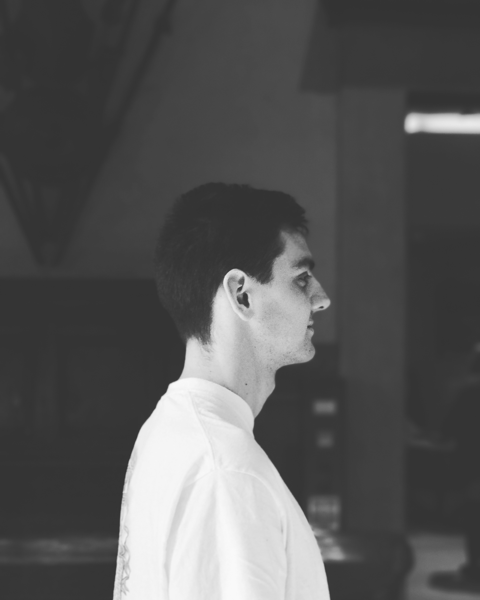

More and more people are interacting with recipes online instead of in print, but the layout and structure of recipes hasn't evolved along with the growth of technology. Chefs of all levels often want to be able to view and interact with an interface that is simple, and easy to navigate. When viewing on a device, simple web interaction can make following along even easier than reading text off of a page. We're excited to explore a platform that would bring thousands of recipes into one easy-to-view layout that makes cooking a seamless and fun experience.

# Team Members
Member | Photograph
--- | ---
Mitchell Mendoza |  |
John Nguyen |  |
Grant Sivesind |  |
Heather Kramer |  |
Hayk Tepanyan |  |

# Team Skills Matrix

Member | Skills | Personal Traits | Desired Growth | Weaknesses 
--- | --- | --- | --- | --- 
Mitchell | Needfinding, user testing, product management, documentation writing  | meticulous, creative, detail-oriented | Coordination of large-scale projects, javascript programming | No specific software expertise other than school projects
Heather | HCI, needfinding, front-end Javascript/D3, defining tasks, documenting | detailed, cautious, logical | Server side implementation, creating stand-alone software end-to-end | Hard time taking risks/moving quickly, overanalyzing 
Grant | Data Mining, Machine Learning, AI, Computer Vision | Meticulous, disciplined | Management, collaboration, GitHub | Tends to procrastinate often 
John | Data analysis, graphic design | Easy-going, detail-oriented  | Programming | Limited experience working on computer science projects and products
Hayk | AI + ML, Data Science, Databases, design of robust software | logical, friendly, always happy to help | ability to successfully join a team mid-way | Procrastination

# Team Communication

1) Can reach us at our individual Stanford emails
2) <a href="https://drive.google.com/drive/u/1/folders/0AAAy28smR17cUk9PVA">Google Drive</a>
3) Task board via <a href="https://trello.com/b/5pOkpNTE/chef">Trello</a>
4) Demo site <a href="https://chefpp.herokuapp.com">here</a>.

